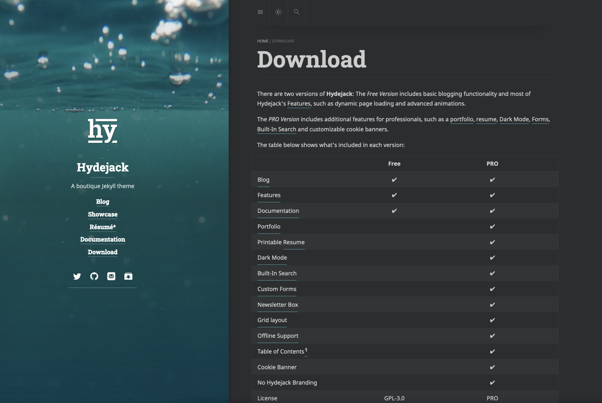

This is the first post in this blog during I'm setting up. This post is to record the themes for Jekyll tool for the blog.

<!--  
 -->

# Themes

- https://hydejack.com/
  - good looking.
  - free, but need to pay $49 to use useful features (e.g., resume, Dark mode).
  - blog to intro this: https://velog.io/@juxgsiroo/github-page-pt2
- https://github.com/samarsault/plainwhite-jekyll
  - sample site: https://samarsault.com/
  - free. simple.
  - theme of the current blog

# Ariticles recommending themes

- https://blog.naver.com/PostView.naver?blogId=josephdev123&logNo=222532864073&parentCategoryNo=&categoryNo=15&viewDate=&isShowPopularPosts=true&from=search

